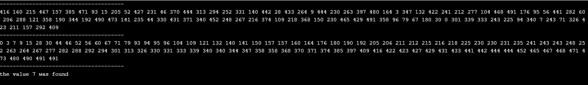
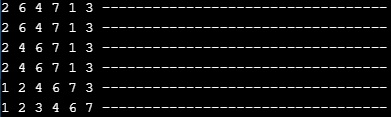
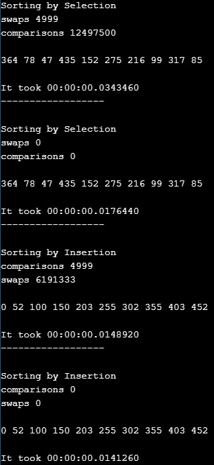
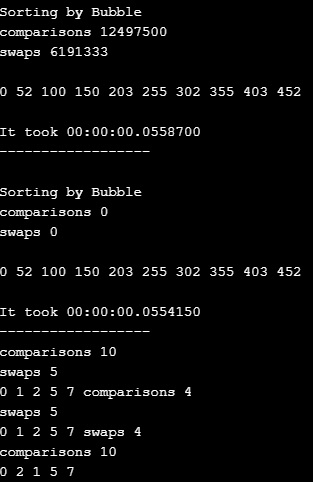

# Algorithms
 **In this programs we develop and improve the use of sort algorithms. Seems like Binary Search, Insertion, Selection and Bubble Sorts.**

## Binary Insertion
* **BinaryInsertion.cs** - The program on the one hand, the insertion algorithm is responsible for taking the array and ordering it in its entirety, while the binary search takes the array and divides it little by little and tells you if the value you are looking for is in that range. 

```csharp
public static int binarySearchTarget(int[] array, int targetValue) {
	    int min = 0;
	    int max = array.Length - 1;
        int guess;
        int result = -1;
    
        while ( min <= max ) {
            guess = ((min + max)/2);
            if (array[guess] == targetValue) { 
              result = guess; 
            } 
    
            if (array[guess] < targetValue ) {
                min = guess + 1;
            } 
            else { 
                max = guess - 1; 
            } 
        }
     return result;
    }  
```
```csharp
public static int[] insertionSort(int[] tab){
        
        int i, key, value; 
        for (i=1; i < tab.Length; i++){
                key = tab [i]; //the second value of the array
                value = i - 1; //the first value of the array
                
                
                while (value >= 0 && tab[value] > key){
                    //insertion of the correct number
                    tab [value + 1] = tab [value];
                    value = value - 1;
                }
                
                tab [value + 1] = key;
            
        }
        return tab;
   }
```
* **Result**

  

## Binary Sort
* **BinarySort.cs** - The program takes the array, generates a secret random number, goes dividing the array in half and looking at that number is in one of the intervals, finally shows the secret random number.

```csharp
public static int GuessTheNumber(int a, int b){
        Random random  = new Random();
        int steps = 0;
        int numberSecret = random.Next(a, b);
        bool notFound = true;
        
        int letItBe;
        while(notFound){
            
            letItBe = (a+b)/2;
            
            if(letItBe == numberSecret){
                notFound=false;
            }
            
            if(numberSecret > letItBe){
                a = letItBe; 
            }
            
            else{
                b = letItBe;
            }
            
            steps++;
              
        }
        
        return steps;
    }
```
* **Result**

  

## Search Numbers with the Insertion Sort
* **SearchNumbers.cs** - This other program show you how works the insertion sort taking the numbers and inserting them in the correct position.

```csharp
public static void insertionSort(int[] numbers)
  { 
        int i, key, value; 
        for (i=1; i < numbers.Length; i++){
                key = numbers [i]; //the second value of the array
                value = i - 1; //the first value of the array
            
                while (value >= 0 && numbers[value] > key){
                    //insertion of the correct number
                    numbers [value + 1] = numbers [value];
                    value = value - 1;
                }
                
                numbers [value + 1] = key;
                Console.WriteLine("----------------------------------");
                printOut(numbers);
            
        }
   } 
```
* **Result**

  

## Insertion, Bubble and Selection Sorts
* **Sorts.cs** - The last program compare diferents algorithms of sorting.


In computer science, selection sort is a sorting algorithm, specifically an in-place comparison sort. It has O(n^2) time complexity, making it inefficient on large lists, and generally performs worse than the similar insertion sort. Selection sort is noted for its simplicity, and it has performance advantages over more complicated algorithms in certain situations, particularly where auxiliary memory is limited.

The algorithm divides the input list into two parts: the sublist of items already sorted, which is built up from left to right at the front (left) of the list, and the sublist of items remaining to be sorted that occupy the rest of the list. Initially, the sorted sublist is empty and the unsorted sublist is the entire input list. The algorithm proceeds by finding the smallest (or largest, depending on sorting order) element in the unsorted sublist, exchanging (swapping) it with the leftmost unsorted element (putting it in sorted order), and moving the sublist boundaries one element to the right.

```csharp
public static int[] sortBySelection(int[] tab, bool display){
        
            long swaps = 0;
            int comparisons = 0;
            //int minIndex;
            int min = tab[0];
            int minIndex = 0;
            for (int i = 0; i < tab.Length; i++)
            {
                int tmp = tab[i];
                
                for (int j = i + 1; j < tab.Length; j++){
                    if (display){
                        comparisons++;
                    }
                    
                    if (tab[j] < min)
                    {
                        min = tab[j];
                        minIndex = j;
                    }
                }
                
                if (i != minIndex)
                {
                   tab[i] = tab[minIndex];
                   tab[minIndex] = tmp;
                   if (display){
                        swaps ++;    
                   }
                   
                   //swaps++;      
                }
            }
            
            Console.WriteLine("swaps " + swaps);
            Console.WriteLine("comparisons " + comparisons);
            return tab;
    }
```

Insertion sort is a simple sorting algorithm that builds the final sorted array (or list) one item at a time. It is much less efficient on large lists than more advanced algorithms such as quicksort, heapsort, or merge sort. However, insertion sort provides several advantages: Simple implementation, Efficient for small data sets, More efficient in practice than most other simple quadratic, Adaptive, efficient for data sets that are already substantially sorted, Stable ...

```csharp
public static int[] insertionSort(int[] tab, bool display){
        int comparisons = 0;
        int swaps= 0;
        int i, key, value; 
        for (i=1; i < tab.Length; i++){
                key = tab [i]; //the second value of the array
                value = i - 1; //the first value of the array
                if(display){
                    comparisons ++;    
                }
                
                while (value >= 0 && tab[value] > key){
                    //insertion of the correct number
                    tab [value + 1] = tab [value];
                    value = value - 1;
                    if (display){
                        swaps ++;    
                    }
                    
                }
                
                tab [value + 1] = key;
            
        }
        Console.WriteLine("comparisons " + comparisons);
        Console.WriteLine("swaps " + swaps);
        return tab;
   } 
```

Bubble sort, sometimes referred to as sinking sort, is a simple sorting algorithm that repeatedly steps through the list, compares adjacent pairs and swaps them if they are in the wrong order. The pass through the list is repeated until the list is sorted. The algorithm, which is a comparison sort, is named for the way smaller or larger elements "bubble" to the top of the list. Although the algorithm is simple, it is too slow and impractical for most problems even when compared to insertion sort. Bubble sort can be practical if the input is in mostly sorted order with some out-of-order elements nearly in position.

```csharp
public static int[] BubleSort(int[] tab, bool display){
            long comparisons = 0;
            long swaps= 0;
            
            int n = tab.Length;
            
            do{
                
                for(int i=0; i< n-1; i++){
                    int tmp = tab[i];
                    if (display){
                        comparisons ++;    
                    }
                    if(tmp > tab[i+1]){
                        //tab.swap(tab[i],tab[i+1]);
                        tab[i]=tab[i+1];
                        tab[i+1]=tmp;
                        if (display){
                            swaps ++;    
                        }
                        
                        //swapped = true;
                        
                    }
                }
                
                n= n-1;
            }while(n != 1);
            Console.WriteLine("comparisons " + comparisons);
            Console.WriteLine("swaps " + swaps);
            return tab;
        }
```
* **Result**

  

  
